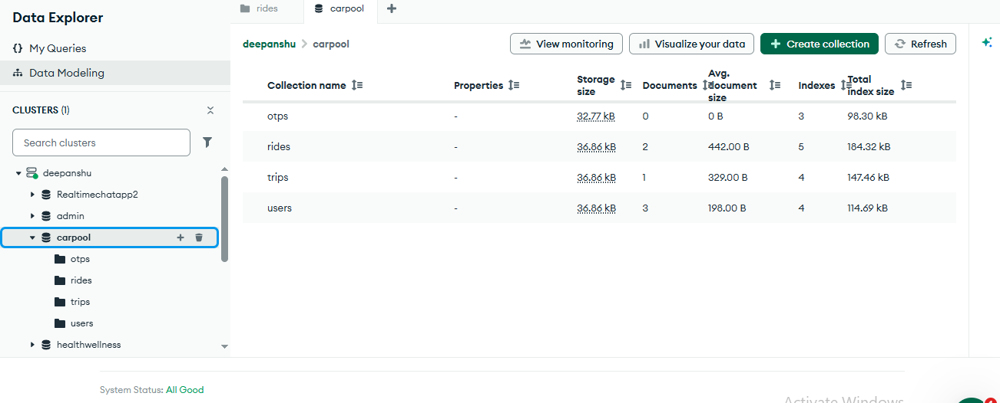
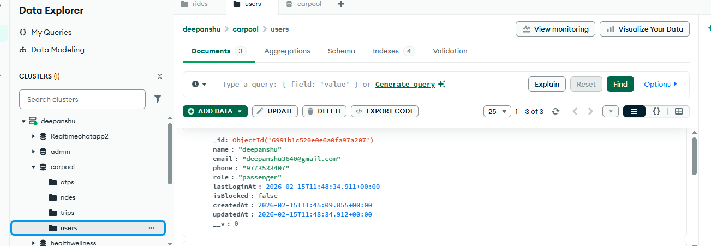
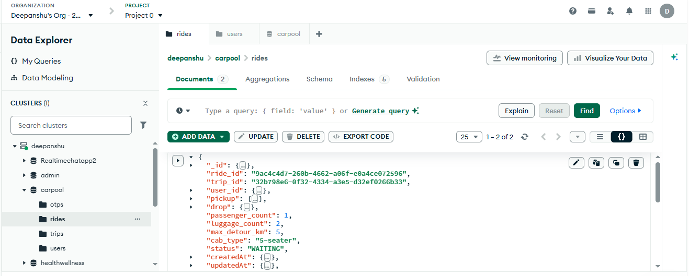
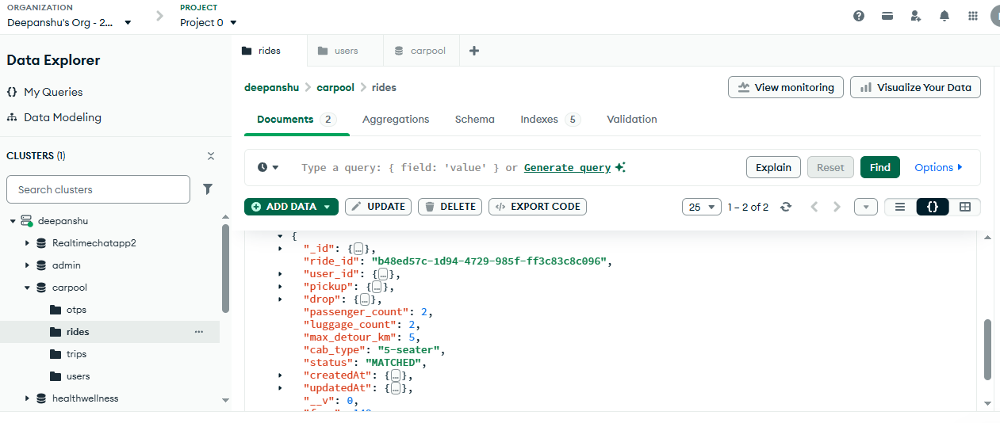

# Test Data – What We Sent vs What Got Stored in DB

Database: **carpool** (MongoDB).  
Scenario: 2 users created; first user booked ride for 1 person → status **WAITING**; second user booked for 2 people with same pickup/drop → **MATCHED**.

**Screenshots (copy your 5–6 MongoDB Compass/Atlas photos into `test-screenshots/` with names in `test-screenshots/README.txt`):**

  
**Screenshot 1:** Carpool DB – Data Explorer showing collections (otps, rides, trips, users) and document/index counts.

---

## 1. Users created (no request body saved – signup + verify OTP used)

  
**Screenshot 2:** Users collection – 3 documents, 4 indexes.

**Stored in DB – `users` collection (3 documents):**

| Field        | User 1 (e.g. deepanshu)   | User 2 (e.g. rakesh)      | User 3 (e.g. deepanshu)   |
|-------------|----------------------------|----------------------------|----------------------------|
| _id         | ObjectId('6991b1c520e0e6a0fa97a207') | ObjectId('6991b54f209aa091e631702a') | ObjectId('6991b5b0209aa091e631702e') |
| name        | deepanshu                  | rakesh                     | deepanshu                  |
| email       | deepanshu3640@gmail.com    | deepanshu8390@gmail.com    | deepanshu87500@gmail.com   |
| phone       | 9773533407                 | 9773533409                 | 9773533408                 |
| role        | passenger                  | passenger                  | passenger                  |
| lastLoginAt | 2026-02-15T11:48:34.911Z    | 2026-02-15T12:00:15.972Z   | 2026-02-15T12:01:52.636Z   |
| isBlocked   | false                      | false                      | false                      |
| createdAt   | 2026-02-15T11:45:09.855Z   | 2026-02-15T12:00:15.974Z   | 2026-02-15T12:01:52.637Z   |
| updatedAt   | 2026-02-15T11:48:34.912Z   | 2026-02-15T12:00:15.974Z   | 2026-02-15T12:01:52.637Z   |

Sample user documents from DB:

  
**Screenshot 3:** User 1 – deepanshu, deepanshu3640@gmail.com, 9773533407.

  
**Screenshot 4:** User 2 – rakesh, deepanshu8390@gmail.com, 9773533409.

  
**Screenshot 5:** User 3 – deepanshu, deepanshu87500@gmail.com, 9773533408.

So: **3 users** in DB. Two of them were used for the ride test (one did first booking, other did second booking).

---

## 2. First ride – 1 passenger → WAITING

**Approx. request sent (POST /rides with Bearer token):**
```json
{
  "pickup_lat": 28.5562,
  "pickup_lng": 77.1,
  "drop_lat": 28.57,
  "drop_lng": 77.32,
  "pickup_address": "Airport Terminal 1",
  "drop_address": "Sector 18, Noida",
  "passenger_count": 1,
  "luggage_count": 2,
  "max_detour_km": 5,
  "cab_type": "5-seater"
}
```

**What got stored:**

- **`rides` collection – 1st document:**  
  - ride_id: e.g. `9ac4c4d7-260b-4662-a06f-e0a4ce072596`  
  - trip_id: same as the one new trip created  
  - user_id: first user’s ObjectId  
  - pickup: { lat, lng, address }  
  - drop: { lat, lng, address }  
  - passenger_count: **1**  
  - luggage_count: 2  
  - max_detour_km: 5  
  - cab_type: "5-seater"  
  - status: **"WAITING"**  
  - fare: not set (null)  
  - createdAt / updatedAt: set by server  

- **`trips` collection – 1 document:**  
  - trip_id: e.g. `32b798e6-0f32-4334-a3e5-d32ef0266b33`  
  - ride_ids: [ that ride_id ]  
  - cab_type: "5-seater"  
  - total_passengers: 1  
  - total_luggage: 2  
  - status: **"WAITING"**  

So: **1 ride** (WAITING) and **1 trip** (WAITING) created.

---

## 3. Second ride – 2 passengers, same pickup/drop → MATCHED

**Approx. request sent (POST /rides with second user’s Bearer token):**
```json
{
  "pickup_lat": 28.5562,
  "pickup_lng": 77.1,
  "drop_lat": 28.57,
  "drop_lng": 77.32,
  "pickup_address": "Airport Terminal 1",
  "drop_address": "Sector 18, Noida",
  "passenger_count": 2,
  "luggage_count": 2,
  "max_detour_km": 5,
  "cab_type": "5-seater"
}
```

**What got stored:**

- **`rides` collection – 2nd document:**  
  - ride_id: e.g. `b48ed57c-1d94-4729-985f-ff3c83c8c096`  
  - trip_id: **same** as the first trip (`32b798e6-0f32-4334-a3e5-d32ef0266b33`)  
  - user_id: second user’s ObjectId  
  - pickup / drop: same as request  
  - passenger_count: **2**  
  - luggage_count: 2  
  - max_detour_km: 5  
  - cab_type: "5-seater"  
  - status: **"MATCHED"**  
  - fare: calculated (e.g. 250)  
  - createdAt / updatedAt: set by server  

- **`trips` collection – same trip updated:**  
  - ride_ids: [ first_ride_id, second_ride_id ]  
  - total_passengers: 1 + 2 = 3  
  - total_luggage: 2 + 2 = 4  
  - status: **"MATCHED"**  
  - total_distance_km: set (e.g. 25)  

- **First ride (in `rides`) updated:**  
  - status changed from WAITING to **MATCHED**  
  - fare set for first ride as well  

So: **2 documents in `rides`**, **1 document in `trips`** (both rides linked to same trip, status MATCHED).

---

## 4. DB snapshot (from your screenshots)

  
**Screenshot 6:** Rides collection – 2 documents (one WAITING, one MATCHED), 5 indexes.

| Collection | Document count | Indexes |
|------------|----------------|---------|
| otps       | 0              | 3       |
| users      | 3              | 4       |
| rides      | 2              | 5       |
| trips      | 1              | 4       |

- **otps:** 0 (OTPs deleted after use or expired).  
- **users:** 3 (as in table above).  
- **rides:** 2 (first = 1 passenger, WAITING→MATCHED; second = 2 passengers, MATCHED).  
- **trips:** 1 (single trip with both rides, status MATCHED).

---

## 5. Short flow

1. User A: Signup → Verify OTP → got token.  
2. User B: Signup → Verify OTP → got token.  
3. User A: POST /rides (passenger_count: 1, same pickup/drop) → New trip + ride created, status **WAITING**.  
4. User B: POST /rides (passenger_count: 2, **same** pickup/drop, same cab_type) → Backend found same WAITING trip, added ride → Trip and both rides became **MATCHED**, fare calculated.  
5. DB: 3 users, 2 rides, 1 trip; indexing used on all collections as in README.

You can paste a screenshot of any new test (request + response or DB view) here later and we can add it as another example.
